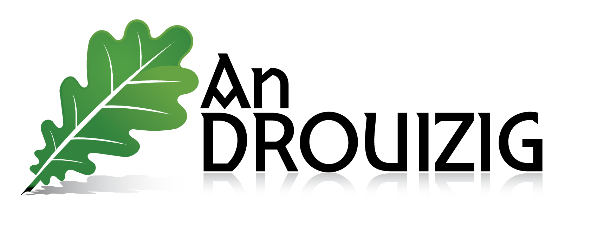

## Ostilhoù niverel e brezhoneg

 <!-- .element height="50%" width="50%" -->

D'ar Sadorn 23 a viz C'hwevrer 2019

Gwenn Meynier - Pêr Morvan 
Note: test note

---

### Ostilhoù niverel e brezhoneg

 * An Drouizig
 * Troidigezhioù e brezhoneg
 * Ostilhoù all (Difazier, klavier c'hwerty...)

---

### An Drouizig : ur gevredigezh oberiant

 * Savet e 2003 e Gwened
 * Brudañ ar brezhoneg war an teknologiezhioù nevez
 * Meziantoù, difazier, klavier ha traoù all

---

### Niverel e brezhoneg : perak ?

 * Ezhomm personel
 * Ur yezh a c’hell bezañ implijet war **an holl dachennoù**, hini an **niverel** ivez
 * Ur redi zoken, hervezomp, evit dazont ar yezh

---

### Troidigezhioù
#### Meziantoù frank a-bep seurt

----

### Peseurt meziantoù?

 * Aodio / video : Clementine, VLC, OpenShot  
 * Grafegoù : GIMP, Tuxpaint, Pinta, Inkscape
 * Bureveg : LibreOffice, AbiWord, Scribus

----

### Peseurt meziantoù?

 * Kelennadel : Gcompris
 * Kenrouedad (internet) : Firefox, Thunderbird, FileZilla, Joomla

----

